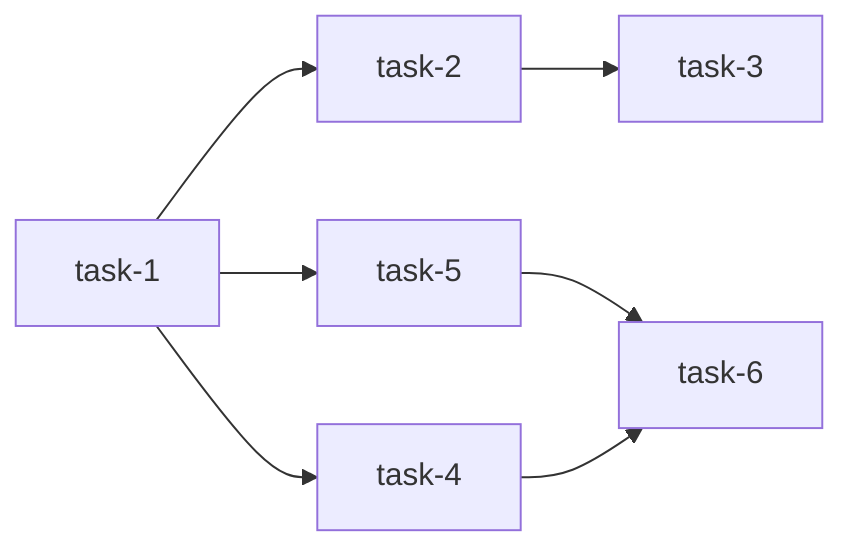

# Plan: <task-slug>

> One-paragraph orientation. What design this plan splits, how many scoped tasks
> it produces, and the spine of the build order. Sibling `design.md` carries the
> resolved direction; this doc is the routing manifest the Schemer reads.

---

## Summary

2-4 sentences. What `design.md` lays out, how it decomposes, and what the
downstream Schemer subagents will produce. Cite design sections inline
(`design.md#decisions`).

---

## Scope split

The core. Numbered list of scoped tasks. Each entry becomes a `tasks/<name>/`
directory with its own `schema.md`.

### 1. `<task-name>`

**Scope.** One paragraph: what this task covers, what artifact it produces,
which design sections it implements (`design.md#area-1.4`).

**Out of scope.** What this task explicitly does _not_ touch - short list,
prevents Schemer drift.

### 2. `<task-name>`

...

---

## Build order

Dependency tree. Use the ASCII arrow form by default; reach for Mermaid only
when the graph is complex (>2 fan-out points).

**Box-drawing form** (default). Linear chains run left-to-right; fan-outs use
box-drawing characters aligned under the originating node:

```text
task-1 --+--> task-2 --> task-3
         +--> task-4
         +--> task-5 --> task-6
```

Reads as: `task-1` precedes `task-2`/`task-4`/`task-5`; `task-2` precedes
`task-3`; `task-5` precedes `task-6`. Characters used: ASCII `- + > |` only.
(Earlier drafts used Unicode box-drawing glyphs; ASCII renders cleanly in every
editor and survives copy through terminal pipelines.)

**Mermaid form** (escape hatch). Use when the graph has more than two fan-out
points or when cross-branch dependencies make the box-drawing form ambiguous:



---

## Open questions

Bulleted list. Each tagged `[for: schemer]` (Schemer can resolve during schema
drafting) or `[for: human]` (needs user input before Schematize proceeds).

- `[for: schemer]` <question>
- `[for: human]` <question>

---

## Out of scope

Explicit non-goals at the _plan_ level - things the design touches but this plan
deliberately doesn't decompose. Distinct from the per-task "Out of scope" inside
`## Scope split`; this is the plan-wide boundary.

1. <item>
2. <item>

---

## Notes

_Optional._ Sequencing rationale, risks, alternatives considered for the split,
or anything the Schemer should know that doesn't belong in a specific scope
item.

---

<!--
Frontmatter notes:
- `created` is the ISO date the plan was drafted.
- Path encodes the design name (`designs/<name>/plan.md`); the
  sibling `design.md` is the upstream artifact. No back-pointer
  fields needed.

Shape reference: notes/template-shapes/plan.md section 4.
-->
